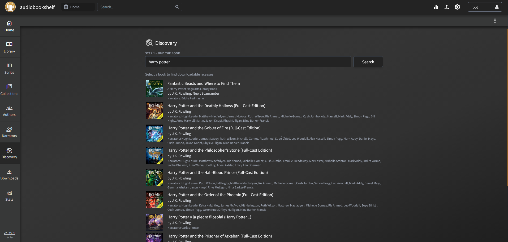

<p align="center"></p>

# Faithnet Reads

A self-hosted home for your audiobooks and ebooks — with a **Netflix / Audible-style home screen** that
showcases what's popular right now (from Audible, Apple Books and Open Library), a **Want to Read** list,
**daily reading goals & streaks**, a redesigned **reader**, and one-click **Get** that finds the book on your
indexers through **Prowlarr**, downloads it with **qBittorrent** and imports it into your library.

Built on [audiobookshelf](https://www.audiobookshelf.org/) **v2.35.1** (GPL-3.0) and fully compatible with its
apps, API and libraries.



## 🏠 The home screen (what's new in Faithnet Reads)

Designed around what makes Netflix, Audible, Apple Books and Jellyfin easy to use:

| Pattern | Why it works | In Faithnet Reads |
|---|---|---|
| **Showcase reel** | A single, striking starting point cuts decision fatigue | Full-width banner cycling through the most highly rated and newest books (tagged *New release*, *Top rated*, *Best seller*): the cover on the left; title, year · rating · length · genre, blurb and **Request** / Get, sample, details and ♥ Want to Read on the right. Swipe it on phones |
| **Stacked themed rows** | Grouped carousels are easy to scan | Continue Listening/Reading, then online rows interleaved with your library's own rows |
| **Top 10 with big numerals** | Rank numbers draw the eye to what's popular | *Top 10 audiobooks today* from the Audible chart |
| **"Because you…" rows** | Personal context makes recommendations trustworthy | *Because you have <author>*, *Continue your series* |
| **Wishlist** | Save now, decide later (Audible wishlist / Apple "Want to Read") | ♡ **Want to Read** on any book, with its own row |
| **Samples** | Hearing the narrator is a top reason people pick an audiobook | **Listen to sample** in the details sheet (Audible) |
| **Reading goals & streaks** | Small daily goals build the habit (Apple Books / Kindle) | Daily goal ring (listening + reading minutes), streak and the last 7 days — on **Your Stats** |
| **Requests that don't give up** | *arr-style "wanted" lists: ask once, get it when it exists | **Request** any book; if it isn't on your indexers yet the request stays open (*Searching*) and is re-checked every 6 hours, then downloaded automatically |
| **Drag to browse** | Rows that move under your finger feel like a real app | Every row swipes on touch and can be grabbed and dragged with the mouse (with a little glide) |
| **One search for everything** | People search for a title before they know if they own it | The search bar shows your library matches *and* **Not in your library** results from the store, each one a tap away from Request |
| **Books that look right** | A downloaded book should look like it did in the store | Getting a book saves the store's cover as its cover, and fills in author photos and bios from Wikipedia (free-licensed Wikimedia Commons images), falling back to Audible's author page |
| **Genres everywhere** | Browsing by mood/genre is how most people discover | Genre rows (incl. Religion & Spirituality), ordered by what you read most; every genre on the Discovery page |

**Online sources** (no accounts or keys needed, cached for a few hours, each one fails independently):
Audible catalog (charts, genres, new releases, series/author lookups, samples) ·
Apple Books top charts (audiobooks & ebooks) · Open Library trending & subjects.
Every cover shows whether it's **In library**, **Downloading** or **Requested**.

---

## 💬 Community & Support

Join the community for help, updates, and discussion: **https://discord.gg/CTpduhwP6x**

---

## What it adds

### ✨ Premium interface
- A full visual refresh: deep cool-neutral surfaces, a warm gold accent, the **Inter** typeface, frosted-glass
  app bar / player / menus, and soft depth instead of flat grey boxes.
- The wooden bookshelf is gone: covers sit on clean rows with rounded corners, a hover lift and a gold
  play button; progress bars glow gold.
- **Item pages** get a blurred-cover hero backdrop (Audible / Jellyfin style), a large title, a progress card
  and pill-shaped Play / Read actions.
- Redesigned side navigation, login screen, settings, dropdowns, inputs, toggles, modals and audio player.

### 📖 Reader overhaul (EPUB)
- **Auto-hiding chrome**: a minimal top bar (back, title, contents, "Aa", full screen) and a bottom bar with the
  current chapter, page-in-chapter, overall % and a **scrubber** to jump anywhere in the book.
- **Tap zones**: tap the left/right edge to turn pages, the middle to show/hide controls (plus swipe & arrow keys).
- **"Aa" appearance panel**: Light / Sepia / Dark / Black themes, **Literata** (bundled reading typeface),
  Georgia, Inter or the publisher's font, font size stepper, line spacing, **margins** (narrow/normal/wide),
  single page or spread, and boldness.
- Table of contents drawer with search, chapter percentages and the current chapter highlighted.
- Fixes: line spacing was an absolute `rem` value applied to every element (crushing headings and ignoring
  font size); the page-turn arrows never updated; the dark page colour didn't match the reader; settings
  stylesheets accumulated on every page render.

### 🛍️ Storefront (Audible-style browse → one-click Get)
- The Discovery page now opens on a **storefront**: a featured hero, genre chips and horizontally
  scrolling shelves of covers — **Best sellers**, **New & noteworthy**, **Top rated** and a shelf per
  genre (ordered by what's most common in your library), all pulled from the public Audible catalog.
- **Personalized shelves** built from your library: **Continue your series** (the next book you don't
  have yet) and **More from &lt;author&gt;** for the authors you collect most.
- Every cover is badged **In library**, **Downloading** or **Requested**, so you never grab a book twice.
- Click a cover for an Audible-like details sheet (cover, narrator, length, rating, series, summary) with
  **Get audiobook** / **Get ebook**. "Get" searches your Prowlarr indexers, **automatically picks the best
  release** (title + author match, m4b/epub preferred, seeders, freeleech, no samples/abridged), and sends
  it to qBittorrent. Users without download rights see **Request** instead, which goes through the
  approval queue. If no release matches confidently you're dropped into the manual picker.
- **See all** on any shelf or genre opens a full grid sortable by best sellers / newest / top rated.

### 📚 Discovery (search → download)
- A **Discovery** button in the library sidebar (book libraries).
- **Step 1 – Find the book:** search book metadata via a choice of providers — **Audible, Google
  Books, Open Library, iTunes, FantLab**, plus any custom providers you've configured — so you pick
  the right title, author and cover. If a book isn't listed, use **Search indexers directly** to skip
  the metadata step and query Prowlarr with raw text.
- **Step 2 – Choose a download:** queries **Prowlarr** across your indexers and lists releases
  (size, seeders, source). An **Audiobook / Ebook** toggle controls what's searched, and each result
  is badged so you can tell them apart. An optional "Refine search" box lets you tweak the exact
  indexer query.
- The chosen release is sent to **qBittorrent**; when it finishes, the files are copied into your book
  library folder and scanned in automatically — no manual importing.

### ⬇️ Downloads tab
- A dedicated **Downloads** page showing every job with live progress.
- **Persisted to the database** — history survives restarts, and in-progress downloads **resume
  tracking and auto-import** after a restart.
- **24-hour retention:** finished/failed entries drop off after a day; active/stalled ones stay until
  done. **Clear** buttons for individual entries and "Clear finished".

### 🙋 Requests, roles & approvals
- New per-user permission toggles (Settings → Users → edit user):
  **Discovery: Download Directly**, **Can Request**, **Auto-Approve Requests**.
- Users without direct-download permission see a **Request** button instead of Download.
- Requests land in an **admin approval queue** (Approve → it downloads / Deny). Users with
  auto-approve skip the queue.

### 📊 Per-user stats
- A **Discovery Activity** panel on each user's page: total **downloads**, **requests**,
  **listen time**, and **read time**.
- **Read time** is newly tracked — the ebook reader sends a heartbeat while you read, accumulated per
  user & book.

### 🔒 Admin-only source
- The release **source (indexer/tracker name)** is shown only to admins; everyone else sees
  "Admin only" (redacted on the server, not just hidden in the UI).

---

## Requirements

- **Docker** (this is distributed as a Docker image).
- A running **Prowlarr** instance with at least one indexer, reachable from the container.
- A running **qBittorrent** (Web UI enabled), reachable from the container.
- A **book** library in audiobookshelf.
- Best results when qBittorrent and this container run on the **same host** and share the
  completed-downloads folder (see below).

---

## Install

The image is provided as a tarball: **`abs-discovery.tar.gz`**.

```bash
# 1. Load the image
docker load < abs-discovery.tar.gz          # -> Loaded image: audiobookshelf-discovery:latest

# 2. Edit docker-compose.yml paths (see below), then start it
docker compose up -d
```

Open **http://<server-ip>:13378/** (served at the root path, like the stock image), create your admin
account, and add a book library.

### docker-compose.yml (included)

```yaml
services:
  audiobookshelf:
    image: audiobookshelf-discovery:latest
    container_name: audiobookshelf
    ports:
      - 13378:80
    volumes:
      - /path/to/audiobooks:/audiobooks     # your media
      - /path/to/ebooks:/ebooks
      - ./config:/config                    # database & settings
      - ./metadata:/metadata
      - /path/to/qbittorrent/completed:/downloads   # qBittorrent's finished-downloads dir
    restart: unless-stopped
    # user: "1000:1000"                     # match your media file ownership if needed
```

The paths on the **left** of each `:` must point at real folders on your host.

---

## Configure Discovery

Settings → **Discovery** (admin):

| Field | Value |
|---|---|
| **Prowlarr Host** | `http://<prowlarr-ip>:9696` (use `http://`, not https) |
| **Prowlarr API Key** | from Prowlarr → Settings → General |
| **qBittorrent Host** | `http://<qbittorrent-ip>:8080` |
| **qBittorrent User / Pass** | your Web UI credentials |
| **qBittorrent Category** | e.g. `audiobookshelf` |
| **Download Path** | the container path where finished torrents land — usually `/downloads` |
| **Target Library** | your book library |

Enable it, hit **Test Connection** (both should go green), and Save.

**One-click Get** (same page):

| Field | Value |
|---|---|
| **Indexers to search** | tick e.g. only **MyAnonamouse** to pin Discovery to it; leave all unticked to use every enabled Prowlarr indexer |
| **Minimum seeders** | releases below this are never auto-picked (default 1) |
| **Prefer freeleech** | boosts releases Prowlarr flags as freeleech (MAM FL/VIP) so they don't hit your ratio |
| **Storefront region** | Audible marketplace for the shelves (US, UK, CA, AU, DE, …) |

### Fitting into an *arr stack
Discovery plugs into the same services Radarr/Sonarr/Lidarr already use — it doesn't need its own:

- **Prowlarr** is the single indexer manager. Add MyAnonamouse (or any book tracker) there once; Discovery
  queries it through Prowlarr's API, just like the *arrs. Torznab categories 3030 (audiobook) and 7020
  (ebook) are used, so movie/TV indexers are ignored automatically.
- **qBittorrent** can be the same instance your *arrs use. Discovery adds torrents under its own
  **category** (default `audiobookshelf`), so Radarr/Sonarr never see or import them, and vice versa.
- Discovery **copies** finished files into your library (it never moves or deletes them), so torrents
  keep seeding — important for ratio-tracked private trackers like MAM.
- It effectively fills the gap left by the retired Readarr: request/approve like Overseerr/Jellyseerr,
  browse like Audible, import into audiobookshelf.

### The Download Path — the one thing to get right
`Download Path` must be the folder **inside the container** where qBittorrent's *completed* files
appear. With the `:/downloads` mount above, that's `/downloads`. Verify:

```bash
docker exec audiobookshelf ls -la /downloads     # should list your completed torrents
```

If qBittorrent saves category downloads into a subfolder, point `Download Path` at that exact
subfolder. The importer locates content by qBittorrent's real `content_path`, so it handles torrents
whose display name differs from the on-disk folder name.

---

## Notes & caveats

- **Legality is the operator's responsibility.** This is a self-hosted media-manager integration
  (same category as Readarr); it is indexer-agnostic and ships no indexers or content. What you search
  for and download is up to you and your local laws.
- **Based on audiobookshelf v2.35.1.** Running it against a database from a *newer* audiobookshelf is a
  downgrade and may not be safe — back up your `/config` before switching an existing install.
- **Ebooks vs audiobooks:** both live in book libraries; a downloaded ebook is imported and readable in
  the built-in reader just like an audiobook.
- **qBittorrent 4.2.1+** recommended (the importer uses the `content_path` field).

---

## Credits & license

Built on **[audiobookshelf](https://github.com/advplyr/audiobookshelf)** by advplyr and contributors.
audiobookshelf is licensed under **GPL-3.0**; this modified build is a derivative work and is
distributed under the same **GPL-3.0** license (see `LICENSE`). The Discovery feature integrates with
[Prowlarr](https://prowlarr.com/) and [qBittorrent](https://www.qbittorrent.org/), which are separate
projects under their own licenses.

**Community:** https://discord.gg/CTpduhwP6x
